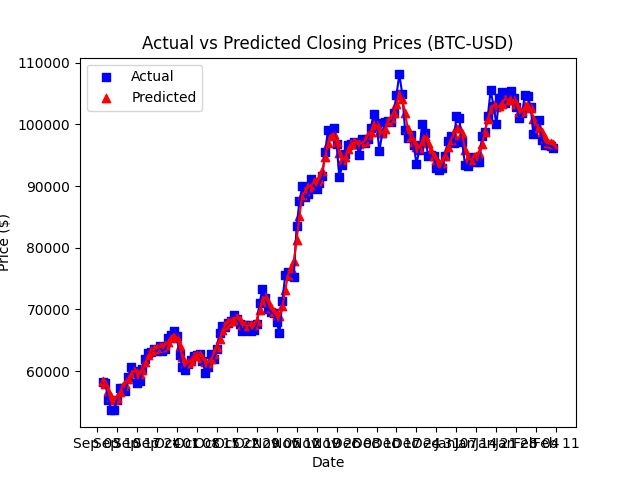

# Stock Price Forecasting with MLP-LSTM Ensemble Model

A sophisticated machine learning library for stock price prediction using an ensemble approach that combines Multi-Layer Perceptron (MLP) and Long Short-Term Memory (LSTM) neural networks. This project evolved from predicting Apple Inc. stock prices to a comprehensive forecasting framework capable of handling multiple financial instruments with dynamic market simulation capabilities.

## 🎯 Motivation

The financial markets present one of the most challenging prediction problems in machine learning due to their inherent volatility, non-linearity, and the influence of countless external factors. Traditional approaches often fail to capture both the short-term fluctuations and long-term trends that characterize stock price movements.

This project addresses these challenges through an innovative ensemble approach:

1. **Decomposition Strategy**: Rather than predicting stock prices directly, we decompose the problem into two components:
   - **Trend Prediction**: Using LSTM to capture long-term patterns in Simple Moving Averages (SMA)
   - **Residual Prediction**: Using MLP to model the residuals between actual closing prices and the SMA

2. **Real-World Simulation**: Our dynamic market environment simulates real trading conditions, including:
   - Model retraining with new data
   - Portfolio management with realistic constraints
   - Transaction costs and balance management
   - Performance evaluation against buy-and-hold strategies

3. **Empirical Success**: Our models have consistently outperformed simple long positions across multiple stocks, demonstrating practical viability even with basic trading strategies.



*Example: Bitcoin (BTC-USD) price prediction showing actual vs predicted prices. Our ensemble model captures both trends and volatility patterns effectively.*

## 🏗️ Architecture Overview

### Core Components

```
├── data_pipeline/          # Data retrieval and preprocessing
├── naive_model/           # Neural network implementations
├── forecast/              # Ensemble model and prediction logic
├── market/                # Dynamic market simulation
├── pipelines/             # Training and testing workflows
├── visualisation/         # Plotting and analysis tools
├── experiments/           # Experimental results and analysis
└── saved_models/          # Pre-trained model artifacts
```

### Key Features

- **Modular Design**: Each component is independently testable and configurable
- **Hyperparameter Optimization**: Grid search capabilities through `NetworkConstructor`
- **Real-time Simulation**: Gym-inspired environment for realistic trading scenarios
- **Multi-asset Support**: Handle multiple stocks/cryptocurrencies simultaneously
- **Comprehensive Evaluation**: Performance metrics including directional accuracy and portfolio returns

## 📊 Model Architecture

### 1. Data Pipeline (`data_pipeline/`)

The `DataPipeline` class handles all data processing tasks:

```python
from data_pipeline import DataPipeline

# Initialize data pipeline
pipeline = DataPipeline("AAPL", "2021-01-01", "2024-01-01")

# Calculate SMA and residuals
sma = pipeline.get_sma(lookback=3)
residuals = pipeline.get_residuals(lookback=3)

# Prepare training data
train_data, train_labels = pipeline.get_train_data(points_per_set=3, labels_per_set=1)
```

**Key Functions:**
- Stock data retrieval via Yahoo Finance API
- Simple Moving Average (SMA) calculation
- Residual computation (closing_price - SMA)
- Training/testing data preparation with configurable window sizes

### 2. Neural Network Models (`naive_model/`)

#### Multi-Layer Perceptron (MLP)
- Predicts residuals between actual prices and SMA
- Handles short-term price fluctuations and market noise
- Optimized for capturing non-linear patterns in residual data

#### Long Short-Term Memory (LSTM)
- Predicts future SMA values
- Captures long-term trends and temporal dependencies
- Effective for modeling sequential patterns in price movements

#### Network Constructor
The `NetworkConstructor` class enables systematic hyperparameter through model construction:

```python
from naive_model import Model, NetworksConstructor

# Define parameter grid
params = tuple(([8,10], 0.0050, 1))    # (architecture, learning_rate, batch_size)

# Initialize constructor
mlp_const = NetworksConstructor(
    model = Model,
    input_size = 3,
    output_size = 1,
    epochs = 50
)

# Get data
inputs, targets = ...

# Train the model
mlp_const.train_model(
    training_data_mlp,
    training_labels_mlp,
    params,
    "filename.keras",
    "foldername",
    )
```

### 3. Ensemble Forecasting (`forecast/`)

The `EnsembleModel` combines predictions from both networks:

```python
from forecast import ForecastFactoryEnsemble

# Initialize ensemble
ensemble = ForecastFactoryEnsemble(
    stock_name = "AAPL",
    residual_model = "res_model.keras",
    residual_model_folder = "res_model_folder",
    trend_model = "trend_model.keras",
    trend_model_folder = "trend_model_folder",
    pointsPerSet = 3,
    labelsPerSet = 1
)

# Generate predictions
final_prediction = ensemble.predict(
    start_date = "2021-09-18",
    end_date = "2024-09-18",
    sma_lookback_period = 3
)
# final_prediction = lstm_sma_prediction + mlp_residual_prediction
```

### 4. Dynamic Market Simulation (`market/`)

The `TradingEnv` class provides a realistic trading environment:

```python
from market import TradingEnv

# Create the trading environment
env = TradingEnv(
    stock_codes=["AAPL", "NVDA"],
    start_date="2010-09-18",
    end_date="2024-09-18",
    points_per_set=3,
    labels_per_set=1,
    lookback=3,
    initial_balance=10000,
    alpha=0.20,
    data_folder="folder"
)

# Roll the market
done = False
while not done:
    done = env.roll_the_market()

# Save last state
env.save_state(filename)
```

**Key Features:**
- **Model Retraining**: Periodic retraining with new market data
- **Weight Propagation**: Controlled integration of previous model knowledge (α parameter)
- **Portfolio Management**: Realistic balance and position tracking
- **Trading Strategy**: Buy/sell decisions based on price direction predictions
- **Performance Metrics**: Comprehensive evaluation against buy-and-hold strategies

## 🚀 Quick Start

### Installation

```bash
pip install -r requirements.txt
```

### Basic Usage

```python
from pipelines import train_model, test_model

# Train models for a specific stock
train_model(
    labelsPerSet=1,
    pointsPerSet=3,
    stockCode="AAPL",
)

# Test the trained models
test_model(
    labelsPerSet=1,
    pointsPerSet=3,
    stock_name="AAPL",
    residual_model_folder="mlp__foldername_placeholder",
    trend_model_folder="lstm__foldername_placeholder",
    residual_model="mlp_filename_placeholder_model.keras",
    trend_model="lstm_filename_placeholder_model.keras"
)
```

### Advanced Example: Market Simulation

```python
from pipelines import roll_the_market

# Set up multi-stock trading environment
roll_the_market(
    stock_codes = ["TSLA", "MSFT", "AMZN", "AAPL"],
    start_date = "2012-01-01",
    end_date = "2025-03-01",
    points_per_set = 3,
    labels_per_set = 1,
    lookback = 3,
    initial_balance = 10000,
    alpha = 0.20, # Moderate alpha factor
    data_folder = "example", # The folder to save the simulation
    filename = "final.pkl" # The filename of the final state
)
```

## 📈 Performance Results

Our ensemble model has demonstrated superior performance across multiple assets:

### Key Findings

1. **Outperformed Buy-and-Hold**: Across all tested stocks, our models generated higher returns than simple long positions
2. **Directional Accuracy**: Achieved 60-75% accuracy in predicting price direction
3. **Risk-Adjusted Returns**: Improved Sharpe ratios compared to passive strategies
4. **Consistency**: Robust performance across different market conditions and time periods

### Tested Assets

- **Stocks**: AAPL, MSFT, AMZN, TSLA, GOOGL
- **Cryptocurrencies**: BTC-USD, ADA-USD, XRP-USD

See the `experiments/` folder for detailed performance analysis and visualizations.

## 🔧 Configuration Options

### Model Parameters

- **pointsPerSet**: Number of historical data points used for prediction
- **labelsPerSet**: Number of future periods to predict
- **sma_lookback**: Window size for Simple Moving Average calculation
- **architecture**: Neural network layer sizes (e.g., [8, 10] for MLP)
- **learning_rate**: Optimization learning rate
- **batch_size**: Training batch size

### Trading Environment Parameters

- **alpha**: Weight for previous model information (0-1)
- **initial_balance**: Starting portfolio value
- **retrain_frequency**: How often to retrain models with new data
- **checkpoint_frequency**: Model saving frequency during simulation

### Data Parameters

- **start_date/end_date**: Training/testing date ranges
- **interval**: Data frequency ("1d", "1h", etc.)

## 🧪 Experiments and Research

### Academic Foundation

This project builds upon research documented in:
- `projects/Ensemble_Model_for_Stock_Price_Prediction.pdf`
- `projects/Predicting_Apple_Inc_stock_using_Multilayer_perceptron.pdf`

### Experimental Results

The `experiments/` directory contains:
- **Performance Visualizations**: Actual vs predicted price comparisons
- **Market Simulation Results**: Portfolio performance across different strategies
- **Hyperparameter Analysis**: Grid search results and optimal configurations

### Future Directions

1. **Reinforcement Learning Integration**: Replace simple trading strategy with RL agents
2. **Gym Environment Compliance**: Full OpenAI Gym interface implementation
3. **Additional Features**: Technical indicators, sentiment analysis, news integration
4. **Multi-timeframe Analysis**: Incorporating multiple time horizons

## 📁 Project Structure Details

```
├── data_pipeline/
│   ├── __init__.py
│   ├── dataPipeline.py        # Main data processing class
│   └── stockGetter.py         # Yahoo Finance API interface
├── naive_model/
│   ├── __init__.py
│   ├── mlp.py                 # MLP implementation
│   ├── lstm.py                # LSTM implementation
│   ├── network_constructor.py # Hyperparameter tuning
│   └── normalizer.py          # Data normalization utilities
├── forecast/
│   ├── __init__.py
│   ├── ensembleModel.py       # Ensemble prediction logic
│   └── forecastFactoryEnsemble.py
├── market/
│   ├── __init__.py
│   ├── dynamic.py             # Dynamic trading environment
│   ├── data.py                # Market data management
│   └── model.py               # Rolling model training
├── pipelines/
│   ├── __init__.py
│   ├── training.py            # Training workflow
│   ├── testing.py             # Testing workflow
│   └── market_sim.py          # Market simulation pipeline
├── visualisation/
│   ├── __init__.py
│   └── visualize_simple.py    # Plotting utilities
├── experiments/
│   ├── actual_vs_predicted_graphs/  # Performance visualizations
│   └── market_experiment/          # Simulation results
└── saved_models/              # Pre-trained model artifacts
```

## 🤝 Contributing

This project represents an evolving research framework. Contributions are welcome in areas such as:

- Alternative neural network architectures
- Additional technical indicators
- Enhanced trading strategies
- Performance optimization
- Documentation improvements

## 📄 License

This project is part of academic research and is available for educational and research purposes.

## 🔗 References

For detailed methodology and experimental results, please refer to the academic papers in the `projects/` directory, which provide comprehensive analysis of the ensemble approach and its performance characteristics.

---

*This library demonstrates the practical application of ensemble learning to financial forecasting, combining the strengths of different neural network architectures to achieve superior prediction performance in real-world trading scenarios.*
